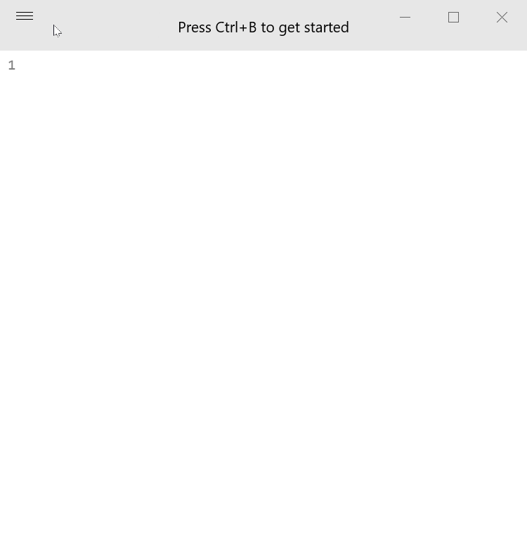

# Woop

A Windows port of [Boop](https://boop.okat.best/)

Woop is scriptable scratchpad that allows you to run any transformations on your text using the builtin or your self-written .js scripts.

